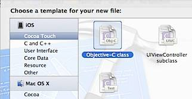

Let us see how to add a class in Objective-C by looking at an example that provides basic functionality of adding two numbers. In this example we will be using Xcode for development similar to the earlier post on [first program in Objective C using Xcode](https://rshankar.com/2012/01/11/my-fiirst-program-in-objective-c-using-xcode/).

This program is going to have to three main section.

- Defining Interfaces.

- Implementing Class methods.

- Using Objective C class in the program.

Xcode users can add a new class to an existing project by clicking File -> New

This would display the following "Choose a template for your new file" window. Now select Objective-C class from the templates and click Next button.

Then provide a name for the Class some thing like Calci. Also select the Subclass for the class as NSObject and click Next button.

Now this would add two files with extension .h and .m, "Calci.h" and "Calci.m".  

**Defining Interfaces**

You can define the interface required for adding two numbers in header file (Calci.h). When you add the class file using Xcode, it will be pre-populated with the following code in "Cacl.h" header file.

//

// Calci.h

// Exercise2

//

// Created by Ravi Shankar on 13/01/12.

// Copyright (c) 2012 \_\_MyCompanyName\_\_. All rights reserved.

//

  

#import <Foundation/Foundation.h>

  

@interface Calci : NSObject

Write two interfaces for setting the two numbers and another interface for adding the two numbers.  

#import <Foundation/Foundation.h>

  

@interface Calci : NSObject

{

int number1;

int number2;

}

  

\-(void) setNumber1: (int) n1;

\-(void) setNumber2: (int) n2;

\-(int) addition;

  

@end

  
**Implementing Methods**  
  
After defining the interfaces, implement those interfaces in .m file (Calci.m). When a new class is added, Xcode will pre-populate the .m file with the following code.  

//

// Calci.m

// Exercise2

//

// Created by Ravi Shankar on 13/01/12.

// Copyright (c) 2012 \_\_MyCompanyName\_\_. All rights reserved.

//

  

#import "Calci.h"

  

@implementation Calci

  
Now add the following piece of code to add the functionality for settings the two numbers and a method that adds these numbers.  
  

#import "Calci.h"

  

@implementation Calci

  

\-(void) setNumber1:(int) n1

{

number1 = n1;

}

  

\-(void) setNumber2:(int) n2

{

number2 = n2;

}

  

\-(int) addition

{

return number1+number2;

}

  

@end

  
**Using Objective C class in the program**  
  
After defining and implementing the interfaces in the .h and .m file, now it is time to use the functionality in the program.  

  @autoreleasepool {

Calci \*calculator;

calculator = \[Calci alloc\];

calculator = \[calculator init\];

\[calculator setNumber1: 35\];

\[calculator setNumber2: 65\];

// insert code here...

NSLog(@"Addition of two numbers %i", \[calculator addition\]);

}

  
The above code creates an instance of the "Calci" class, then passes the two numbers that needs to be added. Finally \[calculator addition\] does the addition and the result is printed using NSLog routine.
