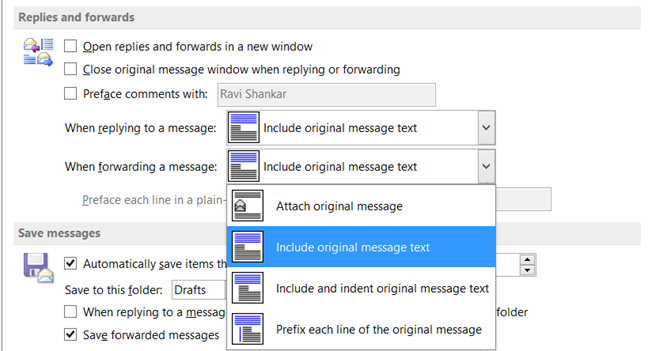

This is in response to question asked by a reader of this blog related with [header and footer in Excel 2010](http://blogmines.com/blog/2012/02/07/turn-off-password-popup-in-outlook-2010/).

> how do I make the header / footer not visible on the page while typing?

When you click on the [insert header and footer](http://blogmines.com/blog/2010/08/22/how-to-insert-header-and-footer-in-excel-2010/) option in Excel 2010, excel would immediately change the view to **Page Layout**. Hence you would see the newly added header and footer in your worksheet.

After typing the required header and footer details and do not want to see header and footer while typing you excel sheet in the data section then you can change the view to Normal by selecting **Normal** under the **Workbook Views** section.

This would temporarily hide the inserted header and footer in the Worksheet and you can always get it back by changing the Workbook view to **Page Layout**.

del.icio.us Tags: [Excel 2010](http://del.icio.us/popular/Excel+2010),[Header](http://del.icio.us/popular/Header),[Footer](http://del.icio.us/popular/Footer),[Hide](http://del.icio.us/popular/Hide),[Workbook](http://del.icio.us/popular/Workbook),[Worksheet](http://del.icio.us/popular/Worksheet),[Views](http://del.icio.us/popular/Views),[Normal](http://del.icio.us/popular/Normal),[Page Layout](http://del.icio.us/popular/Page+Layout)
