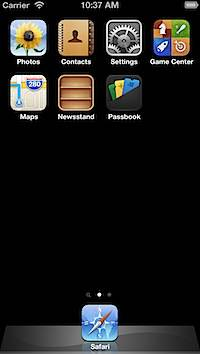
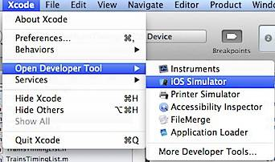
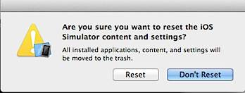
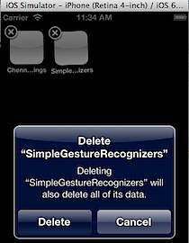
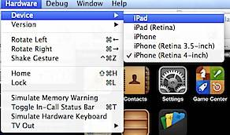
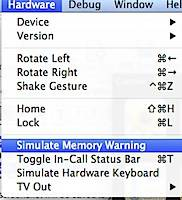
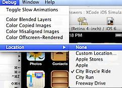
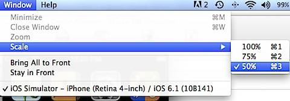

iOS Simulator in Xcode can be used for testing iOS apps before trying the apps on a live device. Listed below are the different settings and features on iOS Simulator.

**Launching iOS Simulator**

iOS Simulator can be launched by executing Program on Xcode

> Run Program on Xcode : Keyboard Shortcut is Command + R, Menu is Product -> Run

The screenshot of IOS Simulator is shown below.

Another alternate way to launch the iOS Simulator is by using the menu option under

> Xcode -> Open Developer Tool -> IOS Simulator

iOS SDK Version

IOS SDK version of iOS Simulator can be determined by clicking the Hardware menu -> Version

**Deleting Apps and Settings**

**Reset Content and Settings** option clears all the apps and settings from the simulator. For example if you have changed the app icon, the new icon will not be displayed unless you delete the app from the simulator and re-run the program.

You can also delete individual apps by clicking and holding the installed apps followed by clicking delete mark just like you do on any iOS device.

**Choosing the device screen on Simulator**

IOS Simulator allows users to choose different device screens such as iPad, iPad (Retina), iPhone, iPhone (Retina 3.5 inch) and iPhone (Retina 4 inch). You can choose the desired screen by navigating to Hardware menu option and selecting the Device.

It is always recommend to try out the apps on the different device simulator before releasing it on the App Store. For example if you are developing an app for the iPhone then you need to try out in all the 4 iPhone device simulator apart from testing your app on live device.

**Taking App Screenshots using Simulator**  

IOS Simulator can be used for taking screenshots of your app for publishing app on the App Store. This is quite useful when you do not have all IOS devices but still want to see the screenshots of your app. The Screenshots can be taken by loading the app on the Simulator and clicking the File menu -> Save Screenshot. The screenshot will be saved to your desktop in .PNG file format.

IOS Simulator also provides option to copy the individual screen from the simulator using the option available as part of the Edit menu.  

**Other Hardware features**

IOS Simulator has features that lets users to see the behaviour of the app on each action such as Rotating Screen to Left, Rotating the Screen to Right, Shake Gesture, Accessing the Home Screen, Locking the Device and also simulating low memory warning.

**Simulate Locations**

Location menu option under the Debug menu is quite useful for development of location based apps. This lets developers to simulate location required for testing their app.

**iOS Simulator Screen Zooming**

IOS Simulator screen size can be increased and decreased based on your need using Window -> Scale menu option.

