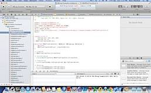

Objective-C like any other programming languages has different data types like int, float, double, char and id. Data types are used for specifying the kind of data that is being stored in a variable. For example, the below code stores a single character to a variable "flag"

char flag = '1'

**Data type - char**

The Objective-C Char data type can store single character of letter or number or special characters. This is done by enclosing the character with in single quotes.

> var example1 = 'W' (store letter)     
> 
> var example2 = '3' (store number)
> 
> var example3 = ':' (store special character)
> 
> var example4 = '/n' (backlash character is a special character)  

**Data type - int**

int data type is used for storing positive or negative whole numbers. The range of values that can stored depends on the 32 bit or 64 bit operating system.

> int count = 10
> 
> int exoctal = 036
> 
> int hex = 0xADD2

in the above example 0 preceding the number represents octal value and hex number is preceded with 0x

**Date type - float & double**

float is used for storing positive or negative decimal numbers.

> float exfloat = 2.45
> 
> float exfloat2 = -0.345
> 
> float exfloat3 = 1.2e4

As shown in the last example, float data type can be represented in scientific notation 1.2e4 which is equivalent 1.2x10th power of 4.

double data type can store twice the range of float.

**Data type - BOOL**

BOOL is used for storing YES or NO i.e 1 or 0

> BOOL flag = 1

**Data type - id**

id data type is used for storing object of any type.

> id myfirstObject

**Qualifiers**

Qualifiers in Cbjective-C are used for increasing range of the data type and the range is system dependant. Qualifiers are placed just before the data type as shown below. The different qualifiers are long, long long, short, signed and unsigned.
