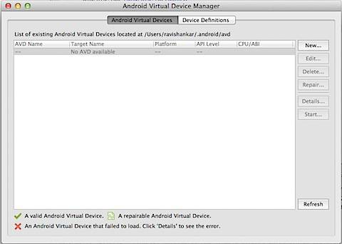
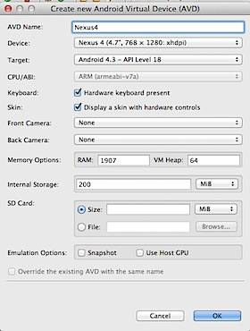

Android Virtual Device are used as [simulator](https://rshankar.com/2013/03/02/xcodes-ios-simulator-for-iphone-and-ipad/) to test your Android application instead of using a real device. "**No compatible targets were found**" is the common message that you will receive while trying to run Android Application Project in eclipse. This occurs if there are no virtual device configured for testing the android apps.

Now let us see how to configure a Android Virtual Device using **Android Virtual Device Manager**.

**Step 1:** Launch Android Virtual Device Manager by clicking the AVD icon in eclipse.

**Step 2**: Click New button in Android Virtual Devices.

**Step 3**: In the Create new Android Virtual Device (AVD) screen, choose the device simulator that you want and enter the other details as shown below.

The AVD also provides option to configure Front and Back Camera, Memory, Internal and SD card storage. After providing the required details click OK button to confirm and save the changes.

Now you should see the newly added Android Virtual Device in the Device Manager. Running the Android Application would launch your app on the Virtual Device.

