This article provides the steps for adding annotation to a MapView in iOS

**Updated: - Click [here](https://rshankar.com/how-to-add-mapview-annotation-and-draw-polyline-in-swift/) for the updated article in Swift**

Create a new Xcode Project - File > New > Project. Select the template for the project as Singe View Application under iOS > Application.

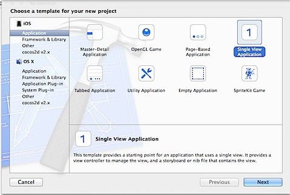

Then provide the required details in the options for your new project screen.

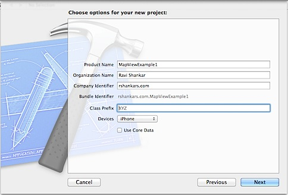

Select Main.storyboard file in the Navigator Area. This should display the User Interface in the Editor Area. Now select Map View from the Object Library, drag and drop it on the User Interface. Adjust the width and height of MKMapView to cover the ViewController.

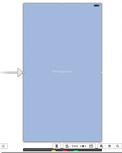

Now is if you try to Build and Run the project on iOS simulator, you will see the following errors message on the console window.

**'[NSInvalidUnarchiveOperationException', reason: 'Could not instantiate class named MKMapView](https://rshankar.com/nsinvalidunarchiveoperationexception-reason-could-not-instantiate-class-named-mkmapview/)'**

This occurs when the MapKit library is not as part of the Link Binary with Libraries under Build Phases.

Now add annotation, let us create a plist file containing array of locations with title, latitude and longitude.

Right click on the Project under the Navigator Area and select New File option.

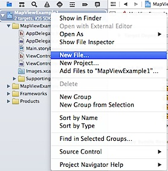

In the template for New File, select Property List under iOS > Resource section.

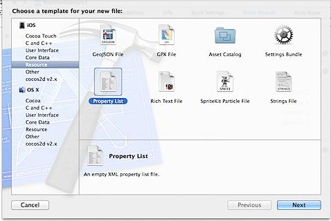

Now provide name for the plist and save it under the Project directory.

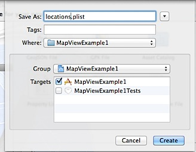

Now change the plist Root type to Array and start adding items of type Dictionary.

The Dictionary item will contain title, latitude and longitude. As shown below, there are 6 items added to plist file.

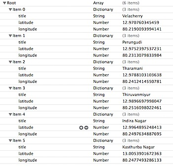

Create MapViewAnnotation class

In order display the location as annotation, we need to create custom annotation implementing the interface MKAnnotation.

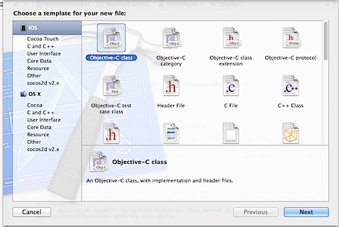

Create a MapViewAnnotation class subclassing NSObject

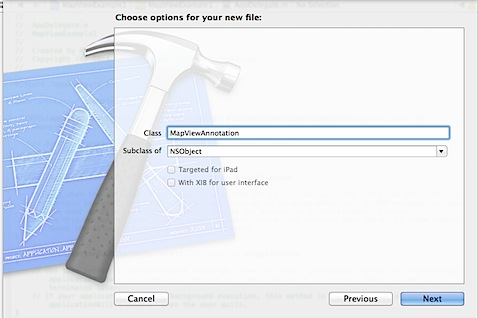

Navigate to MapViewAnnotation.h header file and replace the content with the following

#import <Foundation/Foundation.h>

#import <MapKit/MapKit.h>

@interface MapViewAnnotation : NSObject <MKAnnotation>

@property (nonatomic,copy) NSString \*title;

@property (nonatomic, readonly) CLLocationCoordinate2D coordinate;

\-(id) initWithTitle:(NSString \*) title AndCoordinate:(CLLocationCoordinate2D)coordinate;

@end

Now navigate to MapViewAnnotation.m header file and replace the content with the following.

#import "MapViewAnnotation.h"

@implementation MapViewAnnotation

@synthesize coordinate=\_coordinate;

@synthesize title=\_title;

\-(id) initWithTitle:(NSString \*) title AndCoordinate:(CLLocationCoordinate2D)coordinate

{

self = \[super init\];

\_title = title;

\_coordinate = coordinate;

return self;

}

@end

The above code creates a title and coordinate property and these properties are initialised in the implementation class using the initWithTitle:(NSString \*) title AndCoordinate:(CLLocationCoordinate2D)coordinate method.  
Creating and adding annotation to the MapView  
Create a IBOutlet property to MKMapView and connect the outlet the MapView in the User Interface. After adding the IBOutlet, the ViewController should look like this

#import <UIKit/UIKit.h>

#import <MapKit/MapKit.h>

@interface ViewController : UIViewController

@property (nonatomic,strong) IBOutlet MKMapView \*mapview;

@end

Navigate to ViewController.m and add new method createAnnotations for creating the annotation from the plist and loading the annotation to the map view.

\- (NSMutableArray \*)createAnnotations

{

NSMutableArray \*annotations = \[\[NSMutableArray alloc\] init\];

//Read locations details from plist

NSString \*path = \[\[NSBundle mainBundle\] pathForResource:@"locations" ofType:@"plist"\];

NSArray \*locations = \[NSArray arrayWithContentsOfFile:path\];

for (NSDictionary \*row in locations) {

NSNumber \*latitude = \[row objectForKey:@"latitude"\];

NSNumber \*longitude = \[row objectForKey:@"longitude"\];

NSString \*title = \[row objectForKey:@"title"\];

//Create coordinates from the latitude and longitude values

CLLocationCoordinate2D coord;

coord.latitude = latitude.doubleValue;

coord.longitude = longitude.doubleValue;

MapViewAnnotation \*annotation = \[\[MapViewAnnotation alloc\] initWithTitle:title AndCoordinate:coord\];

\[annotations addObject:annotation\];

}

return annotations;

}

In the above method, we read the locations from the plist file. Then create CLLocationCoordinate2D for each location using the latitude and longitude details. These details are then used for creating the MapViewAnnotation object.  
In the ViewDidLoad method, load the annotations to the MapView by calling createAnnotations method.

\- (void)viewDidLoad

{

\[super viewDidLoad\];

// Do any additional setup after loading the view, typically from a nib.

\[self.mapview addAnnotations:\[self createAnnotations\]\];

}

If you try to build and run the project, these annotations will not be displayed as the map is not zoomed to these locations. You can fix by adding the following zoomToLocation method.

\- (void)zoomToLocation

{

CLLocationCoordinate2D zoomLocation;

zoomLocation.latitude = 13.03297;

zoomLocation.longitude= 80.26518;

MKCoordinateRegion viewRegion = MKCoordinateRegionMakeWithDistance(zoomLocation, 7.5\*METERS\_PER\_MILE,7.5\*METERS\_PER\_MILE);

\[self.mapview setRegion:viewRegion animated:YES\];

\[self.mapview regionThatFits:viewRegion\];

}

The above code, creates coordinate for the zoom location. Then we define MKCoordinateRegion and set that as the region for the map view. The METERS\_PER\_MILE is a constant with the value as 1609.344 which needs to be added after the @implementation ViewController

#define METERS\_PER\_MILE 1609.344

Now you be able to compile and run the project and you should be able to see the following in iOS simulator. And selecting any annotation, should be display the title.

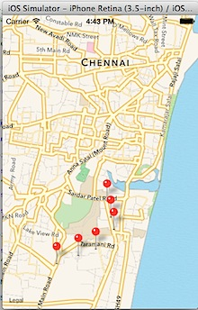

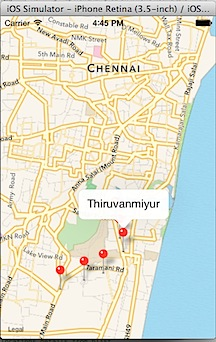

Download the source from [here](https://github.com/rshankras/MapViewExample1)
