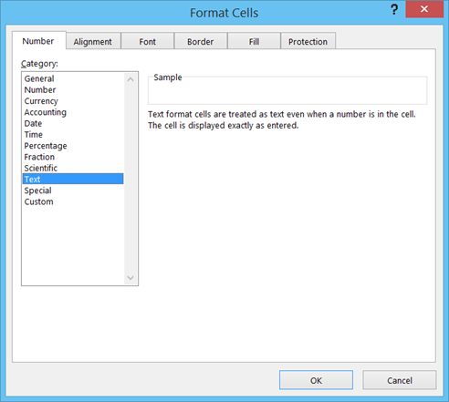

Microsoft Excel has a feature that **automatically coverts two numbers separated by hyphen in to a date** formatted value. For example if you type 6-7 in a cell, Excel would reformat this in to a date value as 7-Jun. But if you do not want to reformat then you can use any of the below mentioned solutions to disable this feature.

Solution 1: **Prefixing the values with apostrophe**

The simplest solution is to add apostrophe before 6-7. This would display the typed value without reformatting it.

Solution 2: **Change format to Text Format**

Another alternate solution is to change the formatting of the cell to Text format. Select the cell (or columns), right click and pick Format Cells from the menu list.

In the Format Cells window, select **Text Format** under Number tab and click OK button to apply the changes.

**Also See**: [How to prefix cell entry with zero in Excel 2013](http://blogmines.com/blog/how-to-prefix-cell-entry-with-zero-in-excel-2013/)
