In this tutorial, we will see the steps for creating simple StopWatch app in Swift Programming language as shown in the below screenshot.

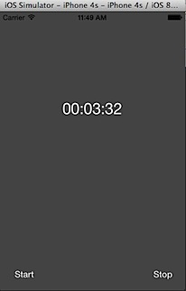

Click File menu -> New -> select Project from menu list.

Choose the template as **Single View Application** and click Next button.

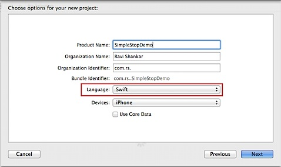

Enter name of the Product, Language as Swift then click Next to specify a folder and save the project.

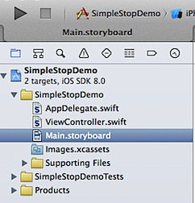

Navigate to Project Navigator and select Main.storyboard. Using the **Attributes Inspector**, change the background colour for the ViewController to **Dark Gray Colour**

Navigate to Object Library, drag and drop UILabel to View Controller. Then align the label horizontally centred to the View Controller. Using the **Attributes Inspector** enter the label text as 00:00:00, change the colour to White, make the text centre aligned and increase the the font size to 27.0

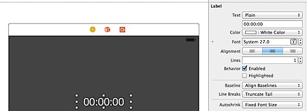

Now drag and drop two buttons for starting and stopping the timer. Change the button text to **Start** and **Stop** respectively and set the Text Color to white.

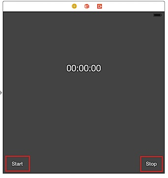

Now select ViewController.swift in the Project Navigator and delete the file, select Move to Trash in the Confirmation box.

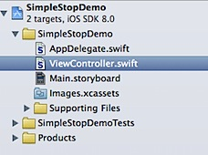

Let us add a new UIViewController file, right click on the SimpleStopWatch folder and select New File from the menu list.

Select the template for the new file as Cocoa Touch Class (under iOS), then click Next

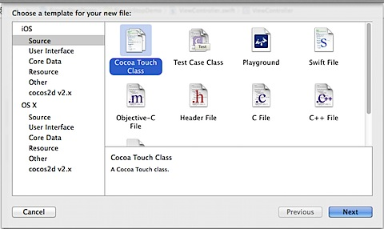

Enter the name of the class as SWViewController, Subclass as UIViewController and Language as Swift. Then click Next and choose the Project folder to save the file.

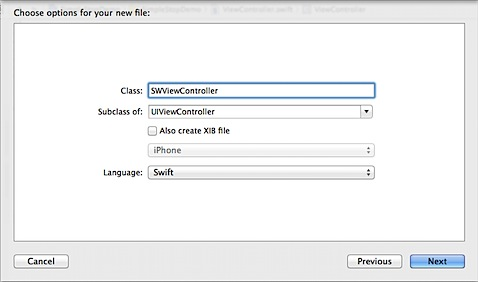

Navigate to SWViewController.swift and add a IBOutlet for UILabel.

\[code language="swift"\]@IBOutlet var displayTimeLabel: UILabel! \[/code\]

Then add two IBActions method for the two buttons, Start and Stop.

\[code language="swift"\] @IBAction func start(sender: AnyObject) { }

@IBAction func stop(sender: AnyObject) { } \[/code\]

 

Navigate to Main.storyboard, select View Controller and specify the class name as SWViewController using the **Identify Inspector**

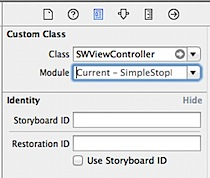

Now you should be able to see the IBActions and IBOutlet defined in the class file using Connection Inspector

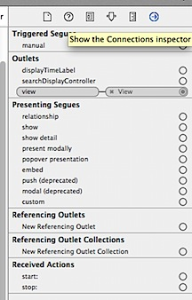

Drag and connect the UILabel with the IBOutlets, similarly connect IBActions with the buttons and specify the event as Touch Up Inside.

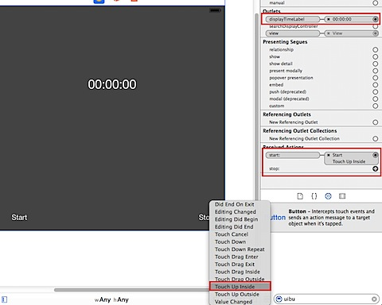

Select the ViewController under View Controller Scene, click the Resolve Auto Layout Issues option and select **Reset to Suggested Constraints**. This would ensure that the alignment of controls remains the same for different screen size.

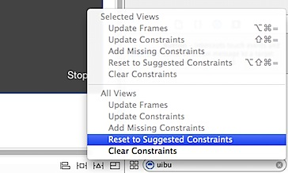

Now if you try to run this project on Simulator, the screen would be as shown below. Nothing should happen on clicking the two buttons as we are yet to add the functionality.

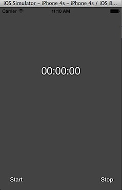

**Write Code logic for StopWatch**

Navigate to SWviewController.swift file and new function name as updateTime. This function will be used for calculating the time in minutes, seconds and fraction of milliseconds.

Add a new class level variable to the class for storing the start time.

\[code language="swift"\]var startTime = NSTimeInterval()\[/code\]

Then add the following code in updateTime method. This is used for calculating the StopWatch time and assigning the value to the UILabel.

\[code language="swift"\]</pre> func updateTime() {

var currentTime = NSDate.timeIntervalSinceReferenceDate()

//Find the difference between current time and start time.

var elapsedTime: NSTimeInterval = currentTime - startTime

//calculate the minutes in elapsed time.

let minutes = UInt8(elapsedTime / 60.0)

elapsedTime -= (NSTimeInterval(minutes) \* 60)

//calculate the seconds in elapsed time.

let seconds = UInt8(elapsedTime)

elapsedTime -= NSTimeInterval(seconds)

//find out the fraction of milliseconds to be displayed.

let fraction = UInt8(elapsedTime \* 100)

//add the leading zero for minutes, seconds and millseconds and store them as string constants

let strMinutes = String(format: "%02d", minutes) let strSeconds = String(format: "%02d", seconds) let strFraction = String(format: "%02d", fraction)

//concatenate minuets, seconds and milliseconds as assign it to the UILabel

displayTimeLabel.text = “\\(strMinutes):\\(strSeconds):\\(strFraction)”

}\[/code\]

Add a new class level NSTimer variable as shown below.

\[code language="swift"\]</pre> var timer = NSTimer()\[/code\]

Navigate to Start IBAction function and add the following the code.

 

\[code language="swift"\]@IBAction func start(sender: AnyObject) { let aSelector : Selector = “updateTime” timer = NSTimer.scheduledTimerWithTimeInterval(0.01, target: self, selector: aSelector, userInfo: nil, repeats: true) startTime = NSDate.timeIntervalSinceReferenceDate() } \[/code\]

This would start a timer and it repeats at regular time interval of 0.01. Here we specify the “updateTime” function which gets called regularly after the specified interval. We also initialise the startTime variable to the current time. Now when the user taps on Stop button, timer is invalidated and set to nil.

\[code language="swift"\] @IBAction func stop(sender: AnyObject) { timer.invalidate() timer == nil } \[/code\]

If you try to run this app on the simulator, you should notice the start and stop functionality works and time is getting displayed in the Label. But the user can repeatedly tap the Start button. So when the clock is running if the user taps the Start button, clock restarts again. We can prevent this by adding the following check to start the timer only when the timer is not running.

\[code language="swift"\]@IBAction func start(sender: AnyObject) { if !timer.valid { let aSelector : Selector = “updateTime” timer = NSTimer.scheduledTimerWithTimeInterval(0.01, target: self, selector: aSelector, userInfo: nil, repeats: true) startTime = NSDate.timeIntervalSinceReferenceDate() } }\[/code\]

Download the source code from [here](https://github.com/rshankras/SimpleStopDemo.git)
