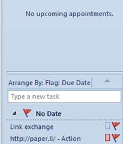
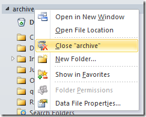

In this tutorial, we will see the steps to open or close archive file in Outlook 2013 and Outlook 2010.

**Open archive file in Outlook 2013 and Outlook 2010**

If you have **archived your outlook items** and you want to **open in Outlook** then you can use the settings available as apart of Outlook Options.

Click on the File menu –> Open –> **Open Outlook Data file** option

This would display the following Open Outlook Data File window.

Navigate to the folder where the archive file present and choose the file. Now the archived items would be available as apart of your outlook folder structure.

**Close archive folder in Outlook 2013 and Outlook 2010**

Outlook users can close open archive folder by following the below mentioned steps.

- Launch Outlook and then move to the Navigation pane.
- In the Navigation Pane, right click on the Archive folder that needs to be closed.

- Select **Close “archive”** option from the list of available menus. By this way you can close an archive file in Outlook 2013 and Outlook 2010

**Also See**: [How to find mailbox size in Microsoft Outlook](http://blogmines.com/blog/how-to-find-mailbox-folder-size-in-microsoft-outlook-2010/)
