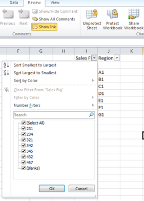
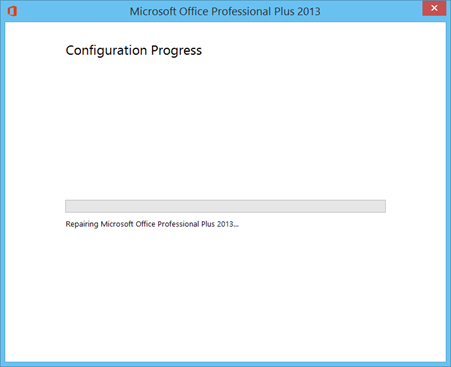
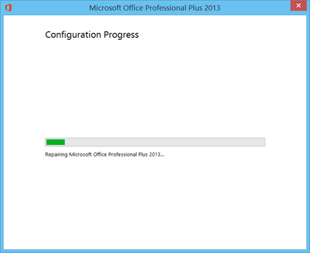
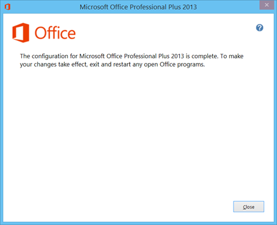

This tutorial provides step by step instruction to **repair Office 2013 products like Word 2013, Excel 2013, Outlook** 2013 etc.. When you encounter problems with your Microsoft Office 2013 installation, then you can try these steps.

**Step 1**: Right click on the Start menu and select Control Panel from the menu list.

**Step 2**: In the Control Panel window, select Programs followed Programs and Features.

 

**Step 3**: Then select Microsoft Office in the Programs list and click Change button available in the menu bar. You can also access Change button by right clicking on the selected Program.

 **Step 4**: In “Change your installation of Microsoft Office Professional Plus 2013” screen, select Repair radio option and click Continue.

This should do the necessary configuration and start repairing Office 2013

**Step 5**: The following confirmation message will be displayed and you will asked to restart the system to reflect the changes.

Click Yes button to reboot the system.

**Also See**: [How to repair Microsoft Office 2010](http://blogmines.com/blog/2011/01/31/how-to-repair-microsoft-office-2010/)
