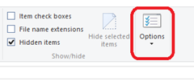
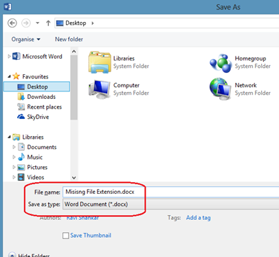
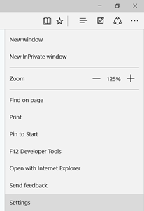

Microsoft Excel 2013 and 2010 by default uses the **system defined decimal separator**. In Windows 8 and Windows 7 this option is defined under the Regional and Language Settings available under Control Panel.

**Step 1**: Right click on the bottom end corner of Window 8 system and select Control Panel from the menu list (In Windows 7, navigate to Control Panel).

**Step 2**: In Adjust your computer’s settings screen, click Clock, Language and Region option.

**Step 3**: In Clock, Language and Region screen, click Change date, time or number formats under Region section.

**Step 4**: Click the Additional settings button in the Region window.

**Step 5**: In Customise Format window, enter the new separator for Decimal Symbol. Then click Apply and Ok button to save the changes.

Microsoft Excel also provides users can customize the separator used for Decimals and Thousands using Excel Options. Listed below are the steps to change decimal separator in Excel 2013 and Excel 2010

**Step 1**: Click File menu and select Options from the menu list.

**Step 2**: In the Options screen, click the Advanced tab and navigate to Editing section.

**Step 3**: Under Editing section, un mark the check box with caption as “User system separators”.

**Step 4**: Now enter your new decimal separator under Decimal separator field. For this demo we are colon (:) as the decimal separator.

**Step 5**: Click OK to confirm and save the changes.

 

<iframe src="//www.youtube.com/embed/5nkXzumshUA" allowfullscreen width="420" height="315" frameborder="0"></iframe>

**Also See**: [How to change decimal separator on Mac OS X Lion](http://blogmines.com/blog/how-to-change-decimal-separator-on-mac-os-x-lion/)
