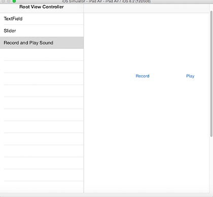

In this tutorial, we are going to see the required steps to record and play sound in Swift Programming language using [AVAudioRecorder](https://developer.apple.com/library/prerelease/ios/documentation/AVFoundation/Reference/AVAudioRecorder_ClassReference/index.html) and [AVAudioPlayer](https://developer.apple.com/library/prerelease/mac/documentation/AVFoundation/Reference/AVAudioPlayerClassReference/index.html)

Download source code from [github](https://github.com/rshankras/SwiftDemo) (SoundController.swift)

**User Interface**

The user interface for this demo is simple with two buttons, one for recording and another for playing sound.



Create corresponding IBAction and IBOutlets from the two button in the View Controller.

```swift
@IBOutlet weak var recordButton: UIButton!
@IBOutlet weak var playButton: UIButton!

@IBAction func recordSound(sender: UIButton)
@IBAction func playSound(sender: UIButton)
```

**Dual Purpose Buttons**  

  

The Record button will be used to record and stop recording. Similarly the Play button will used to Play and Stop the audio.

  

**Class level var and let declaration**

```swift
var soundRecorder: AVAudioRecorder!
var soundPlayer: AVAudioPlayer!
let fileName = "demo.caf"
```

Declare two class level variable for holding an instance of AVAudioRecorder and AvAudioPlayer. Also create constant for holding the file name.  

  

**Create Sound file path**

  

For this demo, the sound file will be created under the Cache directory using the name defined in the constant. Add these two function to your class

```swift
func getCacheDirectory() -> String {
    let paths = NSSearchPathForDirectoriesInDomains(.CachesDirectory,.UserDomainMask, true) as [String]
    return paths[0]
}

func getFileURL() -> NSURL {
    let path = getCacheDirectory().stringByAppendingPathComponent(fileName)
    let filePath = NSURL(fileURLWithPath: path)
    return filePath!
}
```

The getCacheDirectory retrieves the caches directory and getFileURL appends the file name with the cache directory.  

  

**Setup Recorder**

  

Create a new function that prepares the recorder and this function will be called during the viewDidLoad operation

```swift
func setupRecorder() {
    //set the settings for recorder
    var recordSettings = [
        AVFormatIDKey: kAudioFormatAppleLossless,
        AVEncoderAudioQualityKey : AVAudioQuality.Max.rawValue,
        AVEncoderBitRateKey : 320000,
        AVNumberOfChannelsKey: 2,
        AVSampleRateKey : 44100.0
    ]
    var error: NSError?
    soundRecorder = AVAudioRecorder(URL: getFileURL(), settings: recordSettings, error: &error)
    if let err = error {
        println("AVAudioRecorder error: \(err.localizedDescription)")
    } else {
        soundRecorder.delegate = self
        soundRecorder.prepareToRecord()
    }
}
```

To create an AVAudioRecorder instance, you need to pass three parameters,  

  

URL- Specifies the path and name of the file where the sound will be recorded.

settings - Configure [AVRecorder settings](https://developer.apple.com/library/prerelease/ios/documentation/AVFoundation/Reference/AVFoundationAudioSettings_Constants/index.html#//apple_ref/doc/uid/TP40009937)

error - Capture error while creating AVRecorder instance.  

  

If there is no error while creating Audio Recorder, the delegate it set to the View Controller and recorder is prepared for recording. Make sure the View Controller conforms to AVAudioRecorderDelegate

```swift
class SoundController: UIViewController, AVAudioRecorderDelegate {
```

**Prepare Player  
**

  

Add the following function that prepares the AVAudiPlayer to play the recorded sound

```swift
func preparePlayer() {
    var error: NSError?
    soundPlayer = AVAudioPlayer(contentsOfURL: getFileURL(), error: &error)
    if let err = error {
        println("AVAudioPlayer error: \(err.localizedDescription)")
    } else {
        soundPlayer.delegate = self
        soundPlayer.prepareToPlay()
        soundPlayer.volume = 1.0
    }
}
```

AVAudioPlayer instance is created by passing sound file that needs to be played along with pointer to capture errors while creating AVAudioPlayer instance. Make sure the View Controller conforms to AVAudioPlayerDelegate. Then call the prepareToPlay function on the AVAudioPlayer instance.  

  

**Implement IBActions function to record and play sound**

  

Add the following implementation to the IBAction functions which records and plays sound.

```swift
@IBAction func recordSound(sender: UIButton) {
    if (sender.titleLabel?.text == "Record"){
        soundRecorder.record()
        sender.setTitle("Stop", forState: .Normal)
        playButton.enabled = false
    } else {
        soundRecorder.stop()
        sender.setTitle("Record", forState: .Normal)
    }
}

@IBAction func playSound(sender: UIButton) {
    if (sender.titleLabel?.text == "Play"){
        recordButton.enabled = false
        sender.setTitle("Stop", forState: .Normal)
        preparePlayer()
        soundPlayer.play()
    } else {
        soundPlayer.stop()
        sender.setTitle("Play", forState: .Normal)
    }
}
```

When the Record button is tapped, the name of the button is changed to Stop and starts recording the sound. Similarly when the title is Stop, the recording the stopped and play button is enabled. The same is done when the user taps the play button.

```swift
class SoundController: UIViewController, AVAudioRecorderDelegate, AVAudioPlayerDelegate {
```

**Implement AVAudioRecorderDelegate methods**

```swift
func audioRecorderDidFinishRecording(recorder: AVAudioRecorder!, successfully flag: Bool) {
    playButton.enabled = true
    recordButton.setTitle("Record", forState: .Normal)
}

func audioRecorderEncodeErrorDidOccur(recorder: AVAudioRecorder!, error: NSError!) {
    println("Error while recording audio \(error.localizedDescription)")
}
```

**Implement AVAudioPlayerDelegate methods**

```swift
func audioPlayerDidFinishPlaying(player: AVAudioPlayer!, successfully flag: Bool) {
    recordButton.enabled = true
    playButton.setTitle("Play", forState: .Normal)
}

func audioPlayerDecodeErrorDidOccur(player: AVAudioPlayer!, error: NSError!) {
    println("Error while playing audio \(error.localizedDescription)")
}
```

Now you are good to go and try this demo. You can download the source code for re[cording and playing audio in swift from github](https://github.com/rshankras).
