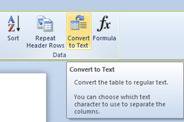
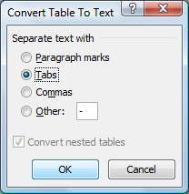

**Microsoft Word 2013 and Word 2010** allows users to change the **CASE** of the **selected text** using the **Change Case** option available as part of the Home menu. For example if you have the following text in your word document and you want to change the CASE by capitalizing each word.

Then select above the text in the Word document and navigate to **Font** **section** in Home menu. Click the drop down arrow below **Aa**.

This would display the following menu option

Select **Capitalize Each Word** option from the list of available menus. Similarly the other CASE related options includes changing the selected text to the following

- Sentence case
- lowercase
- UPPERCASE
- toGGLE  case
