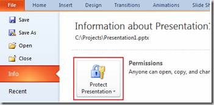
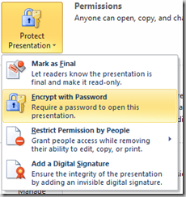
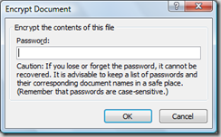
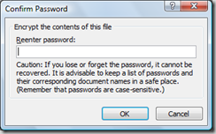
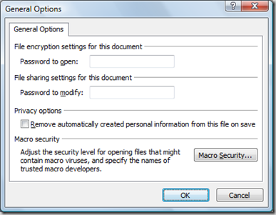
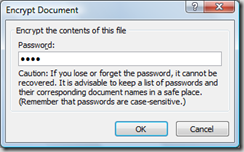

The tutorial explains the **different ways** to **password protect** a **presentation file** in PowerPoint 2013 and PowerPoint 2010. You can password protect a presentation in **PowerPoint 2013 and PowerPoint 2010** by the following ways

1\. Using **Info Menu**

Click File menu followed by Info and then navigate to Permission section.

Click the down arrow available below the **Protect Presentation** option and select Encrypt with Password from the drop down list.

This would display the following **Encrypt Document** window. Enter the password for protecting the file and click OK to save the changes.

Repeat the same as Encrypt Document window for the **Confirm Password** window as well.

A password protected presentation will be highlighted as shown below.

2\. Using **File –> Save As**

The other alternate way to protect a presentation file is to use the General Options same as [password protection of a PowerPoint 2007](http://blogmines.com/blog/2008/06/28/how-to-password-protect-a-microsoft-powerpoint-presentation-2007/) presentation. Click the File mu then the Save As option. In the Save As dialog box, select General Options available as part of tools drop down list.

Using the **General Options**, you can set **password to open** as well as **password to modify** a PowerPoint presentation file. After entering the required details, click OK to confirm and save the changes.

To **remove password protection** for a **presentation**, Navigate to **Protect Presentation** section as discussed earlier and select the **Encrypt Password** from the list. Now **clear** the **password** that was already set for the Presentation then click OK to confirm the changes.

