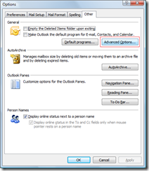
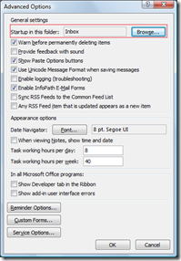
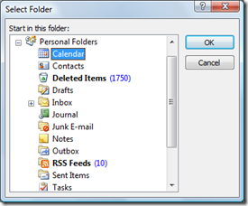

If you are preparing any word document that requires you to type **fraction numbers** then you can use the [Insert Equation](http://blogmines.com/blog/2011/12/05/how-to-enable-insert-equation-in-word-2010/) feature available in **Word 2013 and Word 2010**. Let us say you want to type the fraction numbers 3/15 + 8/15 = ? then you can do the following Word 2013 or Word 2010

Click the Insert menu and navigate to Symbols section.

Then click the Equation option available under the Symbols section. This should insert the Equation place holder in the document as shown below.

Now type the fraction number in the Equation text box and press Enter. This would display the fraction number in the default format.

If you want to change the fraction format or any complex fraction needs to be entered then you can use the Fraction option available under the Structures section.

