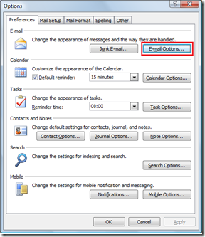
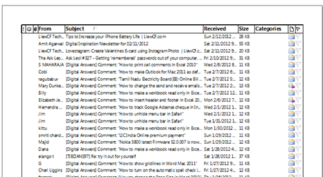

Excel users can **customize** the **Quick Access Toolbar** and add **Calculator** as part of the toolbar. This would allow users to access Calculator without leaving Excel application. Let us now see the steps for **adding Calculator** as part of **QAT**

### Adding Calculator to Quick Access Toolbar in Excel 2013 & Excel 2010

**Step 1**: Launch Excel and click Customize Quick Access Toolbar dropdown.

**Step 2**: Select More Commands from the drop down list.

**Step 3**:  In the Excel Options window, select Commands Not in the Ribbon for the “**Choose commands from**” dropdown.

**Step 4**: Scroll down the commands list and select Calculate Full or Calculator.

Then Click Add button to add the command as part of the Customize Quick Access Toolbar list. Click OK button on Excel Options screen to close the Window.

Now you should see Calculator as part of QAT as shown in the below screenshot. And you can quickly access Calculator without leaving Excel 2013.

 

 

 

<iframe src="//www.youtube.com/embed/SQsT1XMCgus" allowfullscreen width="560" height="315" frameborder="0"></iframe>
