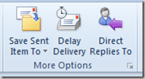
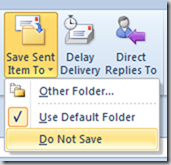
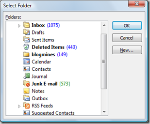

Microsoft Outlook automatically saves the sent messages in sent items folder. But if you do not want to automatically save the sent messages then you can turn off this feature using Outlook Options. Listed below are steps to **enable or disable saving copies of messages in Sent Items folder in Outlook 2013, Outlook 2010 and Outlook 2007**.

**Outlook 2013 and Outlook 2010**

Click the File menu –> click the Options link . In the Options window select the Mail tab and scroll down to Save Messages section.

You can **turn off** or **disable** the **save sent messages** sent items folder by un marking the checkbox with label as **Save copies of messages in the Sent Items folder**.

**Save message in Sent Items for single message in Outlook 2013 and Outlook 2010**

The above settings would affect all the message but if you want to specify only for selected messages then you can use the options available as part of Message window.

In the message window, navigate to Options menu then to the more options section.

Click the down arrow available below the **Save Sent Item** **To** menu option.

The different options that are available are

**Use Default Folder** – This would save the sent messages in the default sent items folder.

**Other Folder** – This allows users to specify the folder where this messages needs to be saved.

**Do Not Save** – This will **not save the sent messages** to any folder.

**Outlook 2007**

In Outlook 2007 to enable or disable “Save copies of messages in Sent Item folder”, Click **Tools** ->**Options**  -> **Email Options**

Under **Message Handling** section, by checking **Save copies of messages in Sent Items folder**, messages that are being sent would be saved to Sent Items folder.

**Also See**: [How to automatically save messages in Outlook 2010](http://blogmines.com/blog/how-to-automatically-save-messages-in-outlook-2010/)
