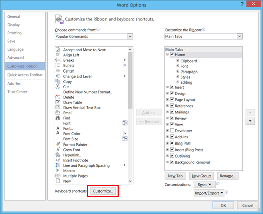

**Word 2016, 2013 and 2010** provide users with the option to **insert mathematical equations** in a document. This is quite useful when you are preparing a word document with mathematical questions. Users can **insert equations** using the option available as part of the Office Ribbon’s Insert menu.

But when you open an existing document created in Word 2003, the equation menu option would be disabled.

This is because this feature is available only for document with extension as **.docx** and not doc. And to resolve this problem all you need to do is to resave the document in Word 2010 file format. Please make sure to pick the value for **Save as type** drop down as “Word Document (\*.docx)”.

The following confirmation message would be displayed, click OK to continue with converting the document.

By this way you can **enable the insert equation** option in a Word document.
