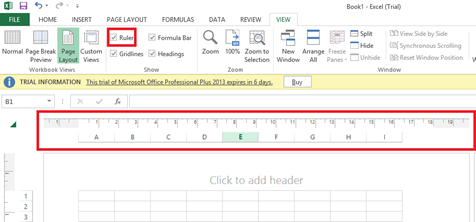
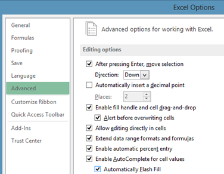
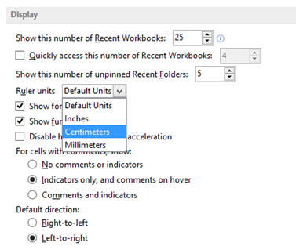

The **default ruler units in Excel 2016, 2013 and Excel 2010** is set to Centimetres and users can change this default units using the Settings available as part of the Excel options.

### View Ruler in Excel 2013

The Page Layout view will be display the ruler in Excel. And in case if the ruler is not displayed then make sure to mark the checkbox with label as Ruler.

### Change ruler units in Excel

**Step 1**: Click the File menu and select Options from menu list.

**Step 2**: In the Excel options window, click Advanced tab and navigate to Display section.

**Step 3**: In the Display section, click the Ruler units drop down and select your preferred unit.

**Step 4**: Click Ok button to apply and save the changes.
