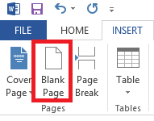
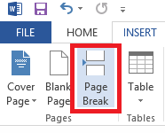
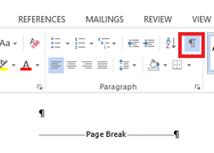

This tutorial explains the steps required to insert or delete empty pages in Word 2016, 2013 and 2010. 

### Adding new page to Word document

There are different ways of inserting new page in Word document such as

- Using the Blank Page option available as part of Insert menu.
- Using the Page Break option  available as part of Insert menu.
- Simply press Enter on the Keyboard at the end of page.

### Insert Blank Page

Navigate to Insert menu and click the Black Page option under Pages section.

When you want quickly insert multiple blank pages then you can use this option.

### **Insert Page Break**

If you want to create a new page with the existing content then click the Page Break option under the Pages section.

  
The most easiest way to add new page is by pressing the Enter key on the Keyboard at the bottom of an existing page.  

### Delete page

Users can remove an empty or blank pages in Word document by

- Pressing the Backspace key on the Keyboard from the end of the page that needs to be removed.
- Pressing the Delete key on the Keyboard from the end of the page after which the pages needs to be removed.
- Use the Show paragraph marker then press the Delete key on the Keyboard

