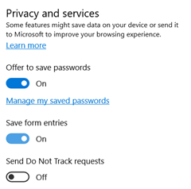

Microsoft Edge provides users with the option to change password for websites. Listed below are the steps to **manage passwords for websites** in Microsoft Edge

**Step 1**: Click the More actions option in Microsoft Edge and select Settings from the list.

**Step 2**: In the Settings, scroll down to Advanced Settings and click View Advanced Settings option.

**Step 3**: In the Advanced Settings, navigate to Privacy and services section. Microsoft Edge saves password for website only if Offer to save passwords switch is On.

Click Manage my saved passwords option to see the list of websites for which the user credentials have been saved.

**Step 4**: Now select the website for which you want to add or edit password.

