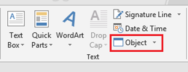
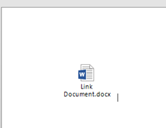
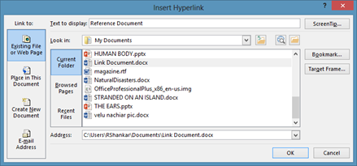
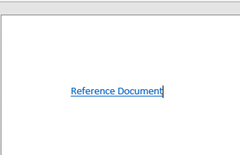

Users of Word 2016 and 2013 can create a link to another document within their document using the **Insert Object** or **Hyperlink** feature. This is quite useful when you want to include reference documents inside your document.  

### Insert Object

**Step 1**: In the main document, navigate and place the cursor to the position where you want to insert the document.

**Step 2**: Click the Insert menu then the Object option available under Text section.

**Step 3**: In the Object window, click Create from File tab and choose the required file via browse button.

Make sure to mark the check box with caption as “**Display as icon**”. If you want the changes to linked document to be reflected in your document then mark checkbox with label as Link to file.

**Step 4**: Click the OK button to confirm and save the changes. Now your document will have a link to the other document as shown below

### Hyperlink

Another alternate way to link a word document is by [creating hyperlink](http://blogmines.com/blog/2013/05/13/how-to-insert-hyperlink-in-word-2013/) pointing to that document.

**Step 1**: Access the Insert Hyperlink window via the right click Context Menu or Hyperlink option under the Links (Insert menu)

**Step 2**: In the Link to section choose **Existing File or Web Page** then select Current Folder option under Look in section.

**Step 3**: Give a name to the Linked document by entering the name in Text to display and then pick the required document.

**Step 4**: Click Ok button to confirm and save the changes.

This should create a link to the document as shown below.

