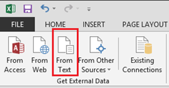
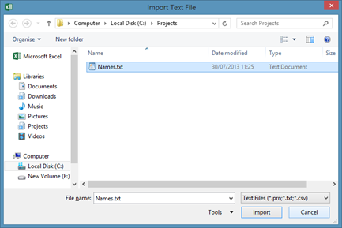
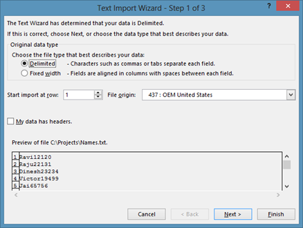
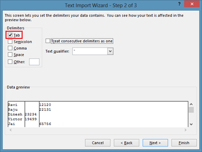
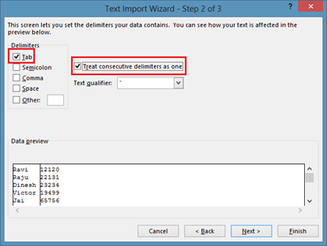
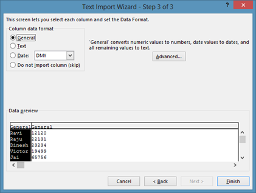
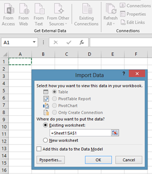
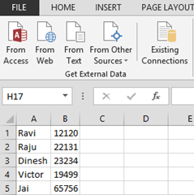

This tutorial is provided step by step instruction to **import a text file in to Worksheet in Excel 2016 and 2013**. For this demo, let us take the following sample data with the columns separated from tabs and spaces.

**Step 1**: Launch Excel Workbook and click the Data menu. Then navigate to Get External Data section.

**Step 2**: Click the From Text option under Get External Data section.

**Step 3**: In the Import Text File window, select Text file and click Import button. This should display the following Text Import Wizard.

**Step 4**: The columns in the text file have been separated using the tabs. Hence we have selected Delimited option for “Choose the file type that best describes your data”.

**Step 5**: After selecting an appropriate value for Start import at row and File Origin, click the Next button.

**Step 6**: In Step 2 of Text Import Wizard, choose appropriate delimiter under Delimiters section. You can preview the selection using Data preview section.

I have selected “Treat consecutive delimiters as one” as the text file used for import has more than one consecutive delimiters. Now you can see the Data preview section display the of data as 2 columns.

**Step 7**: Click the Next button to access the data format screen in **Text import Wizard**.

Here you can set the **data format** for the columns to either General, Text or Date. Similarly if you do not want to import any column then highlight it under Data preview select and select **Do not import**.

**Step 8**: Click Finish button on Text Import Wizard for completion.

**Step 9**: Now you will be show the above dialog box to choose “Where do you want to put the data”. You can either specify range on existing worksheet or New worksheet.

**Step 10**: After selecting the appropriate option under Import Data screen, click OK button to insert data from the text file.

<iframe src="//www.youtube.com/embed/aYDNWzRzVuY" allowfullscreen width="420" height="315" frameborder="0"></iframe>
