Let us see an example TaskManager app using **CoreData written in Swift Programming language**. This app provides the following functionality

- Allow users to enter new task

- Update existing task

- delete task

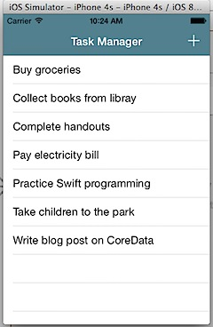

You can download source code for this project from [Github](https://github.com/rshankras/Swift-Demo/tree/master/TaskManager). If you are familiar with user interface then move on to the Core Data implementation in Swift section

Create a new File -> New -> Project and select template Single View Application


Enter Product Name, Language as Swift and select "**Use Core Data**" for the new Project.


### User Interface Implementation

#### Add new TableViewController for managing tasks

Delete ViewController.swift and Add new view controller which will be used for displaying the list of tasks.

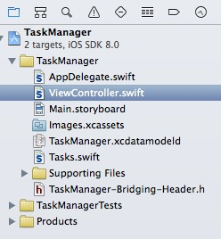

Right click on the Project and select New File


Choose the template as Cocoa Touch under iOS -> Source

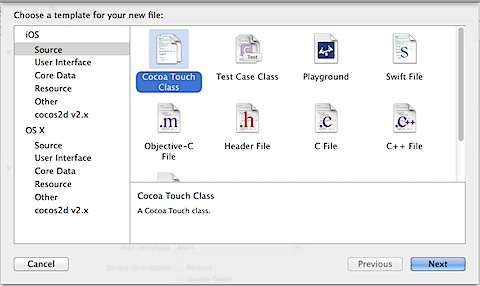

Enter name of the file as TaskManagerViewController with Subclass as UITableViewController and **Language as Swift**.

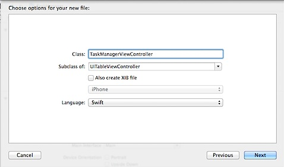

#### Add new UITableViewController to the Storyboard

Navigate to Main.storyboard, delete the ViewController and add new TableViewController to the Storyboard


Embed this TableViewController inside a navigation controller. You can do this by clicking Editor menu -> Embed In -> Navigation Controller.

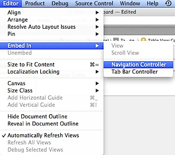

Navigate to Storyboard file and select Table View Controller. Click Identity Inspector and set the Class to the TaskManagerViewController.

#### Add button to the navigation bar

Users can navigate to new task screen by tapping the button on the TaskManager. Drag and drop the button bar item to the navigation bar.


In the attributes inspector, set the identifier for button bar item as Add. Also enter title as “Task Manager” in the navigation bar.

####   
**Add View Controller for entering task detail**

Now to enter task detail, let us add new View Controller. From the Objects library, drag and drop View Controller on to storyboard. Then drag and drop a navigation item to this View Controller. Add a Done bar button item for saving the changes, Cancel bar button item for dismissing the screen. Also provide a title for the screen as Task Detail.

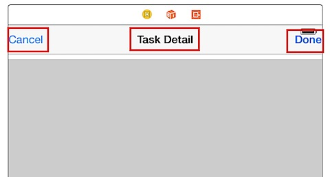

Then add a textfield to the View Controller to enter details about the task.

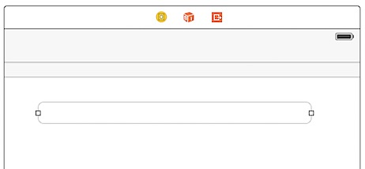

Now to connect the Task Manager screen to Task Detail screen, select the Add button in Task Manager screen, hold the control button and make a connection to the Task Detail screen. Select type of **Action Segue as Show**.  

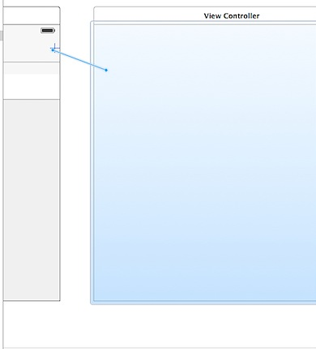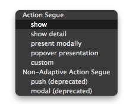

Select each View Controller and Click on the **Resolve Auto Layout** Issues option and pick **Reset to Suggested Constraints**. This would ensure that the controls alignment and display remains same in different screen sizes.


#### Add View Controller Class

Right click on the Project, select New File from menu list.

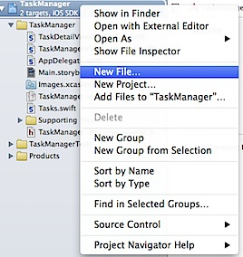

Select Cocoa Touch Class as template.


Enter the Class name as TaskDetailViewController, Subclass of UIViewController and Language as Swift.

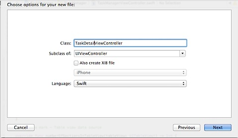

Navigate to Storyboard file and select Task Detail View Controller. Click Identity Inspector and set the Class to the TaskDetailViiewController.

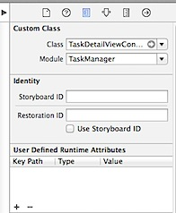

Now let us add the function required for dismissing the View Controller. This gets called when user taps done and cancel buttons. Navigate to TaskDetailViewController.swift file and add the following functions.

```
    
   @IBAction func done(sender: AnyObject) {
        if task != nil {
            editTask()
        } else {
            createTask()
        }
        dismissViewController()
    }
    
    @IBAction func cancel(sender: AnyObject) {
         dismissViewController()
    }
    
    // MARK:- Dismiss ViewControllers
    
    func dismissViewController() {
        navigationController?.popViewController(animated: true)
    }

```

Connect the IBActions with the corresponding done and cancel buttons


Try to compile and run the app on the Simulator. You should see the following Task Manager screen and tapping + sign should display the Task Detail screen with TextField, Cancel and Done button.

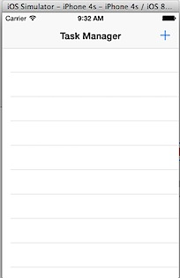

When you tap the Cancel or Done button should take you to the Task Manager screen.

#### **Create IBOutlet element for UITextField Element**

Add the following piece of code after the Class TaskDetailViewController: UIViewController  

```
@IBOutlet var txtDesc: UITextField!
```

Now use the connection inspector to connect the IBOutlet variable to the textfield on the User Interface.

### **Core Data Implementation**

Click Show Project Navigator and select CoreData model file (ending with extension .xcdatamodelid)

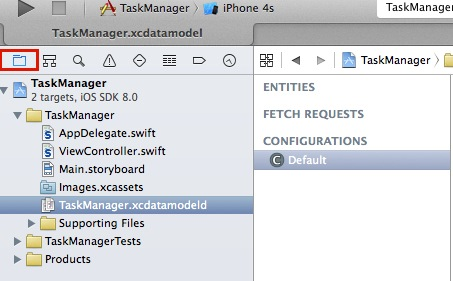

Click Add Entity option available at the bottom of Xcode Editor window.

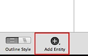

Then enter the name of the entity as Tasks.

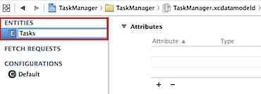

Click Add Attribute then enter name as desc and choose the type as String. This attribute will be used for storing the task detail information.

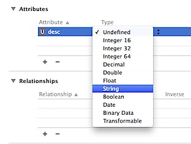

Now to generate the CoreData mapping class, click Editor and select **Create NSManagedObject Subclass**.

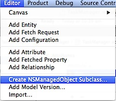

Select the data models and click Next

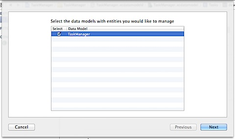

Then select entities and in this example it is Tasks

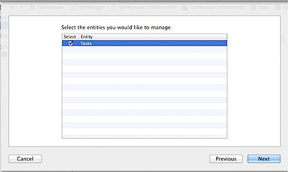

Make sure to select **Language for NSManagedObject class as Swift**. Click Create to the create new class.

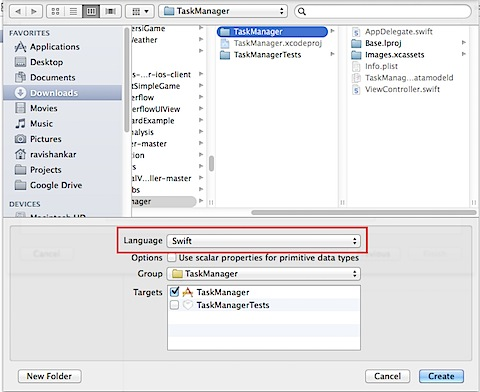

Click Yes to to configure an Objective-C birding header for the Swift class.


This should create a new class called Tasks.swfit with variable for corresponding attribute defined in Entities

### Write code to save new task details

Add the following line at the top of TaskDetailViewController class  

```
  let managedObjectContext = (UIApplication.shared.delegate as! AppDelegate).managedObjectContext
```

The above line defines a variable to store the ManagedObjectContext. In order to save the task information entered in the UITextField, add the following code to TaskDetailViewController.swift. Then call this function in the @IBAction done.  

```
   func createTask() {
        let entityDescripition = NSEntityDescription.entity(forEntityName: "Tasks", in: managedObjectContext)
        let task = Tasks(entity: entityDescripition!, insertInto: managedObjectContext)
        task.desc = txtDesc.text!
        do {
            try managedObjectContext.save()
        } catch _ {
        }
    }

```

```
@IBAction func done(sender: AnyObject) {
	createTask()
	dismissViewController()
}

```

The createTask function uses the Tasks Entity class and ManagedObjectContext class to save the information entered in the text field in to SQLite using CoreData.

Now if you try to run this app in Xcode simulator, you should be able to enter the details in textfield and save the task. But there is no way to see the saved tasks.

### Write code to retrieve information from SQLite using NSFetchedResultsController

We will be using [NSFetchedResultsController](https://developer.apple.com/library/prerelease/ios/documentation/CoreData/Reference/NSFetchedResultsController_Class/index.html#//apple_ref/occ/instm/NSFetchedResultsController/objectAtIndexPath:) to retrieve and manage information returned from Core Data. Write the following code after the class declaration of TaskManagerViewController class  

```
 let managedObjectContext = (UIApplication.shared.delegate as! AppDelegate).managedObjectContext
    
var fetchedResultController: NSFetchedResultsController = NSFetchedResultsController<NSFetchRequestResult>()
    
```


You might see the above error message “Use of undeclared type ’NSFetchedResultsContoller”. This can be fixed by importing CoreData module and making your class a delegate of NSFetchedResultsControllerDelegate.  

```
import CoreData

class TaskManagerViewController: UITableViewController, NSFetchedResultsControllerDelegate {
```

Then add the following function to populate fetchedResultController.

```
  
    func getFetchedResultController() -> NSFetchedResultsController<NSFetchRequestResult> {
        fetchedResultController = NSFetchedResultsController(fetchRequest: taskFetchRequest(),  managedObjectContext: managedObjectContext, sectionNameKeyPath: nil, cacheName: nil)
        return fetchedResultController
    }
      

```

Update the ViewDidLoad method of TableViewController to populate fetchedResultController variable and set the delegate to self and call the function to retrieve the results.  

```
override func viewDidLoad() {
        super.viewDidLoad()

       fetchedResultController = getFetchedResultController()
        fetchedResultController.delegate = self
        do {
            try fetchedResultController.performFetch()
        } catch _ {
        }
    }

```

### Implement the TableView related functions to display the data

Navigate to Main.storyoard then to TaskManagerViewController and set Identifier for Prototype Cells as “Cell"


Add the following functions required for population of rows in tableView and to refresh the tableView when content is changed.

And for refreshing the tableview content add the following piece of code snippet.

```
  func controllerDidChangeContent(_ controller: NSFetchedResultsController<NSFetchRequestResult>) {          tableView.reloadData()
    }

```

Swift uses namespaces for classes, so the downcast of NSManagedObject class to Tasks class will work only when you append the module name with the class for Entity

```
  let task = fetchedResultController.object(at: indexPath as IndexPath) as! Tasks
```

Navigate to TaskManager.xcdatamodeld, select Tasks under Entities and using the Data Model Inspector append Module name i.e TaskManager with the class.

``

Now you should be able to see the data added via TaskDetailScreen in the TaskManager Screen.

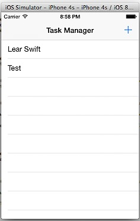

###   
**Implementation of deleting rows from tableView and CoreData entity**  

Copy and paste the following code to provide the users with the option to delete the rows.

```
 override func tableView(_ tableView: UITableView, commit editingStyle: UITableViewCell.EditingStyle, forRowAt indexPath: IndexPath) {
        let managedObject:NSManagedObject = fetchedResultController.object(at: indexPath as IndexPath) as! NSManagedObject
        managedObjectContext.delete(managedObject)
        do {
            try managedObjectContext.save()
        } catch _ {
        }
    }
```

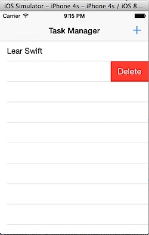

###   
**Implementation of editing task details**

Now let us see how to edit a task in the TaskManager screen. We will re-use the same TaskDetail screen for editing the task information. First let create segue from UITableViewCell to TaskDetailViewController. You can do this by holding the Control key and drag and drop the connection to TaskDetailViewController.

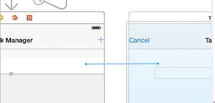

Make sure to set the Segue identifier as edit using Attributes Inspector

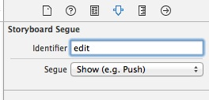

Add the following piece of code in TaskManagerViewController to populate the task detail for the edited row.  

```
      override func prepare(for segue: UIStoryboardSegue, sender: Any?) {
        if segue.identifier == "edit" {
            let cell = sender as! UITableViewCell
            let indexPath = tableView.indexPath(for: cell)
            let taskController:TaskDetailViewController = segue.destination as! TaskDetailViewController
            let task:Tasks = fetchedResultController.object(at: indexPath!) as! Tasks
            taskController.task = task
        }
    }
    

```

Navigate to TaskDetailViewController and variable which used to pass the task details across the ViewControllers  

```
var task: Task? = nil
```

In viewDidLoad fund, populate the textField with the task details for edit operation i.e task is not nil

```
 override func viewDidLoad() {
        super.viewDidLoad()
     if task != nil {
            txtDesc.text = task?.desc
        }
    }
```

Then add a new function to save the edited task. Also modify the done function to handle create and edit task functionality

```
func editTask() {
       task?.desc = txtDesc.text!
        do {
            try managedObjectContext.save()
        } catch _ {
        }
    }

```

```
@IBAction func done(sender: AnyObject) {
        if task != nil {
            editTask()
        } else {
            createTask()
        }
        dismissViewController()
    }

```

Now when you run the app in Xcode simulator, you should be able to edit the task.

  
The final piece of code left is to add background colour to the navigation bar for both the controllers. Click AppDelegate.swift file and add the following function. Then call this function from the didFinishLaunchingWithOptions.

```
    func setupAppearance() {
        let navigationBarAppearance = UINavigationBar.appearance()
        navigationBarAppearance.barTintColor = UIColor(red: 51.0/255.0, green: 104.0/255.0, blue: 121.0/255.0, alpha: 1.0)
        navigationBarAppearance.tintColor = UIColor.white
        navigationBarAppearance.titleTextAttributes = [NSAttributedString.Key.foregroundColor:UIColor.white]
    }


```

Running the app on the iOS simulator should change the appearance for the navigation bar.


Hope you found this beginner tutorial useful. Please use the comments section to share your thoughts and suggestion

Download the source code for this tutorial from [GitHub](https://github.com/rshankras/Swift-Demo/tree/master/TaskManager)
